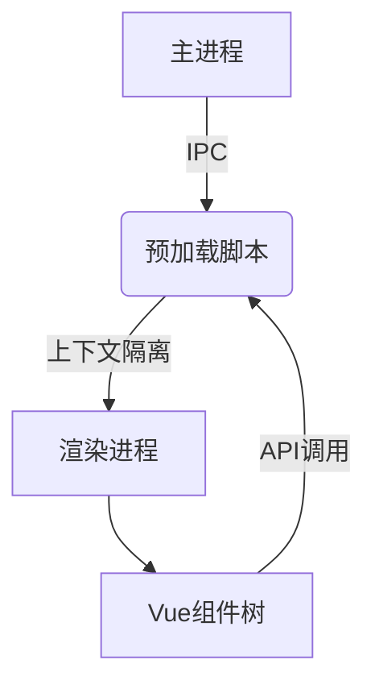

# picio

An Electron application with Vue

## Recommended IDE Setup

- [VSCode](https://code.visualstudio.com/) + [ESLint](https://marketplace.visualstudio.com/items?itemName=dbaeumer.vscode-eslint) + [Prettier](https://marketplace.visualstudio.com/items?itemName=esbenp.prettier-vscode) + [Volar](https://marketplace.visualstudio.com/items?itemName=Vue.volar)

## Project Setup

### Install

```bash
# PICIO 文档管理系统

## 项目结构
```
├── src
│   ├── main            # Electron主进程代码
│   ├── preload         # 预加载脚本(IPC通信)
│   └── renderer        # Vue3前端模块
│       ├── public      # 静态资源
│       └── src
│           ├── assets    # 样式/字体/配置
│           ├── components # 可复用组件
│           └── views     # 页面视图组件
```

## 核心接口
```javascript
// 预加载模块暴露的Electron API
window.electronAPI = {
  // 通用IPC调用
  invoke: (channel, data) => ipcRenderer.invoke(channel, data),
  
  // 文件操作接口
  readFile: (data) => ipcRenderer.invoke('read-file', data),
  readFileBuffer: (data) => ipcRenderer.invoke('read-file-buffer', data),
  
  // 窗口管理
  createChildWindow: (config) => ipcRenderer.send('create-child-window', config)
}
```

## 开发指南
```bash
# 安装依赖
npm install

# 启动开发模式（主进程 + 渲染进程）
npm run dev

# 构建桌面应用程序
npm run build

# 代码质量检查
npm run lint
```

## 文档管理规范
- 元数据存储：public/doclist.json
- 支持格式：PDF/TXT/EPUB/Markdown
- 封面管理：默认使用/public/img/pbook.jpg
- 数据校验：采用JSON Schema验证文档元数据格式

## 架构示意图


### Development

```bash
$ npm run dev
```

### Build

```bash
# For windows
$ npm run build:win

# For macOS
$ npm run build:mac

# For Linux
$ npm run build:linux
```
